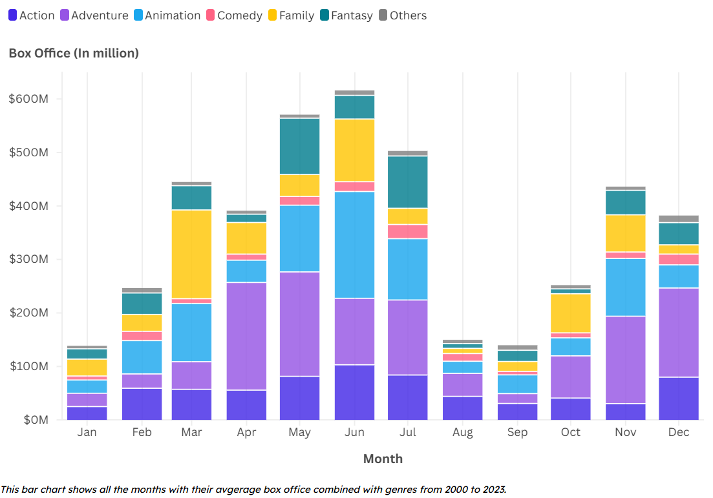
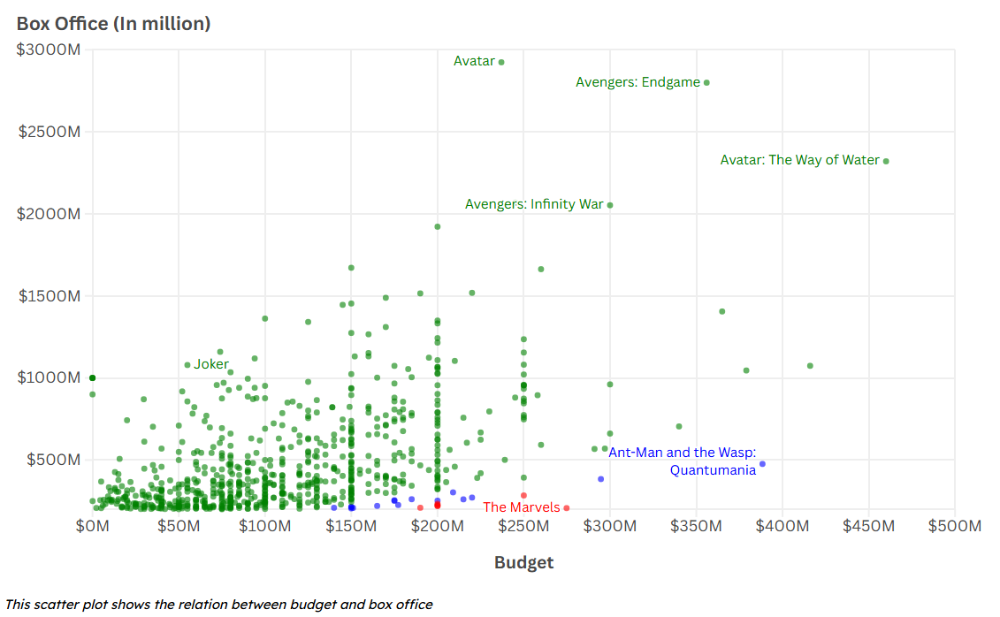

SUPSI 2024-25  
Data Visualization course, M-D3202E  
Teacher Giovanni Profeta


# Analyzing Factors Influencing the Box Office of a Movie
Authors: Sam Hufkens, Kadir Özden, Jorge Garcia, Ilyas Qasemzada

[Analyzing Factors Influencing
the Box Office of a Movie](https://github.com/SamHufkens/data_vis_project_website)


## Abstract
This project analyzes factors influencing the box office performance of movies using the TMDB Movies dataset (2000–2023). Focusing on key parameters such as genre, director, budget, and release month, we aim to provide actionable insights for film industry professionals. After preprocessing the dataset with Python, the analysis revealed several patterns: Adventure and Action genres consistently dominate revenue, with directors like Anthony Russo, Joe Russo, and James Cameron leading their respective categories. The best months for releasing movies are May, June, and July, capitalizing on the summer movie season. A positive correlation was observed between budget and revenue, though low-budget films with strong audience appeal can also achieve significant success. The findings offer valuable guidance for directors, producers, and investors in optimizing production and marketing strategies.


## Introduction
Movie production companies are always looking for ways to improve their strategies to earn the highest box office revenue. Knowing what makes a movie successful can help directors, producers, and investors make better decisions. For this project, we used the TMDB Movies dataset, which contains data from 2000 to 2023, to analyze the key factors that influence box office performance. By looking at genres, directors, budgets, and release months, we aim to find trends and provide insights that professionals in the film industry can use to improve their projects.
To identify the primary factors influencing box office performance, we addressed the following questions:
1.	How do top directors contribute to box office performance across various genres?
2.	What is the best month to release a movie?
3.	Does a movie's budget influence its box office performance?
4.	What is the evolution of total box office revenue from 2000 to 2023?

This project is designed for film industry professionals, including directors, producers, and investors. By focusing on genre profitability, director impact, and budget dynamics, the findings aim to support strategic decision-making in movie production and marketing.
We utilized the TMDB Movies dataset, containing 28 variables, and filtered the data to include movies released between 2000 and 2023. Preprocessing involved selecting relevant features, handling missing data, and simplifying genre classification. After filtering, the dataset included 39,189 records with features such as title, budget, revenue, director, and genre.
The goal of this project is to provide insights into the factors influencing box office success, enabling professionals to optimize movie production.


## Data sources
We used the TMDB Movies dataset from kaggle, this dataset contains 28 variables. One of the most important features is the gross, this specifies how the much the movie earned, and also if it was successful.

[Main datasource](https://www.kaggle.com/datasets/alanvourch/tmdb-movies-daily-updates)

## Data pre-processing
We preprocessed our data with python using the pandas library. The first thing we did was selecting the necessary variables and handling missing data. The genre column had different genres for every row, so we took the first most important genre, so we would be able to visualize it better. We also removed rows where the runtime of the was 0.0. At last we filtered the data to only have the movies with a release year between 2000 and 2023 (included), we did this because more recent movies are more important for our target audience. We ended up with 39189 records and with the following variables: title, runtime, vote_average, vote_count, release_date, budget, popularity, director, cast, revenue, Genre and release_year.


```Python
import pandas as pd

DATA_PATH = "./TMDB_all_movies.csv"
df = pd.read_csv(DATA_PATH)
df = df[["title", "runtime", "vote_average", "vote_count", "release_date", "budget", "popularity", "genres", "director", "cast", "revenue"]]

# Remove rows with missing values
df = df.dropna()

# Extract primary genre from genres
df['Genre'] = df['genres'].apply(lambda x: x.split(',')[0])
df = df.drop(columns=["genres"])

# Convert release_date to datetime format and extract year
df['release_date'] = pd.to_datetime(df['release_date'])
df['release_year'] = df['release_date'].dt.year

# Filter data for the specified years and non-zero budgets or revenues
df = df[(df['release_year'] >= 2000) & (df['release_year'] <= 2023)]
df = df[(df['budget'] != 0) | (df['revenue'] != 0)]

# Remove rows where runtime is 0.0
df = df[df['runtime'] != 0.0]
```

## Data visualizations

### The Evolution of the Box Office from 2000 to 2023 
To illustrate the evolution of the box office over time, we used a line graph and show the total box office for each year, as it effectively highlights trends. We added annotations to emphasize significant events between 2000 and 2023. Additionally, we included a prefix in the labels to clarify that the values represent monetary amounts, specifically in US dollars.


### Influence of Key Genres and Directors
We also wanted to analyze which genre is the most popular and identify the most prominent directors within each genre. To visualize this, we created a treemap. Each genre was assigned a distinct color, which can be consistently applied across other visualizations. The size of the boxes in the treemap represents the influence of each genre and director, making it easy to compare their popularity and impact.


### Best Month to Release a Movie
Another important factor to consider is identifying the best month to release a movie and determining which genres perform the best during that time. To explore this, we created a new variable called "month" based on the release date. Different colors were used to represent genres, ensuring consistency by using the same color scheme as in the previous visualization.



### Budget vs Box Office

We wanted to see if a movie’s budget affects its box office performance, so we created a scatter plot to show the relationship. To make it easier to see the data, we reduced the number of points and made them more transparent. We also labeled a few key movies to make the plot more informative.



## Key findings
**Evolution from 2000 to 2023**
experienced a general upward trend until 2019, reflecting steady growth and the impact of blockbuster releases like "Avatar." The sharp decline in 2020 due to the Covid-19 pandemic highlights the industry's vulnerability to global events. However, the recovery from 2021 onwards demonstrates the industry's resilience, with revenues returning to pre-pandemic levels by 2023.

**Best Month To Release a Movie**
May emerged as the optimal month for movie releases, achieving the highest average box office revenue. The early summer period significantly boosts audience attendance. June and July also show strong performance, benefiting from the summer movie season.

**Influence of Genres and Directors**
Adventure, Action, Animation, Comedy, and Drama were identified as the top-performing genres. Directors like Anthony Russo & Joe Russo (Adventure), James Cameron (Action), Michael Jelenic & Aaron Horvath (Animation), and Greta Gerwig (Comedy) consistently achieved high box office success within these genres.

**Budget Influence on Box Office**
There is a positive correlation between a movie's budget and its box office revenue, indicating that higher-budget films generally earn more. However, the variability within this trend highlights the inherent risks and the potential for lower-budget films to achieve substantial success if they resonate well with audiences.

**Recommendations for producers**

•	Focus movie releases in May, June, and July to capitalize on high box office revenue during the summer movie season. Avoid releasing movies in January, as it has historically shown the lowest average revenue. 

•	Prioritize producing movies in Adventure, Action, Animation, Comedy, and Drama genres, as these have consistently generated high box office returns. Collaborate with top-performing directors within these genres to leverage their successful track records.

•	Investing heavily in a movie's budget can significantly boost its box office potential. However, historical data shows that higher budgets don't always guarantee success, as other factors like marketing and audience reception also play crucial roles. 


## Next steps
The next step could be to build a regression model. This model would use the analyzed factors such as genre, director, budget, and release month to predict a movie's revenue. By using these insights, the model could help producers and investors estimate the potential box office earnings of a movie based on its characteristics.

## Website
[https://datavismoviesproject.netlify.app/](https://datavismoviesproject.netlify.app/)